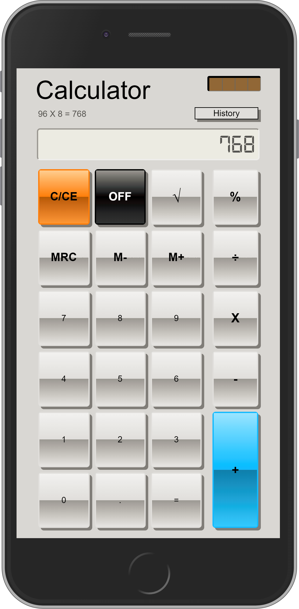

# Calculator
### The classic calculator everyone loves. Some of the functionality this calculator includes are a history view, memory functions, visible type history, and more.

Below you will find some information on how to perform common tasks. 

## Functions

- [Addition](#addition)
- [Subtraction](#subtraction)
- [Division](#division)
- [Multiplication](#multiplication)
- [Percentage](#percentage)
- [Square Root](#square-root)

- [Supported Browsers](#supported-browsers)
- [Something Missing?](#something-missing)

## Addition

Calculator can add stuff:

* `+` is a globally recognized symbol... almost.
* Adding is very important in Math, and one of the four basic operations in arithmetic.
## Subtraction

Calculator can take away stuff:

* 5 take away 2 is 3. Don't want to do that in your head? Use Calculator.
* Subtraction is also very important in Math, and another of the four basic operations in arithmetic.
## Division

Calculator can divide things:

* `/` can be used for a number of things. Calculator uses the obelus (÷) though.
## Multiplication

Calculator can increase, decrease, or keep numbers the same by means of MULTIplication:

* Ever have to add a number to itself. Ever have to do that 1000 times!? Use multiplication!.
* Multiplication is the inverse of division. So there's that...
## Percentage

Per-cent issues? No problem for Calculator:

* Need to get a percentage into a number. Easily type in the number followed by pressing `%` and you're golden.
## Square Root

♫ Who can get the square root (who can get the square root)? The Calculator Man. (The Calculator Man) ♫:

* I think the song says it all.

## Supported Browsers

By default, the generated project uses the latest version of React.

You can refer [to the React documentation](https://reactjs.org/docs/react-dom.html#browser-support) for more information about supported browsers.

## Something Missing?

If you have ideas for a cool calculator function, We encourage you to make your own calculator, and put it on that. And be We, I mean I.
